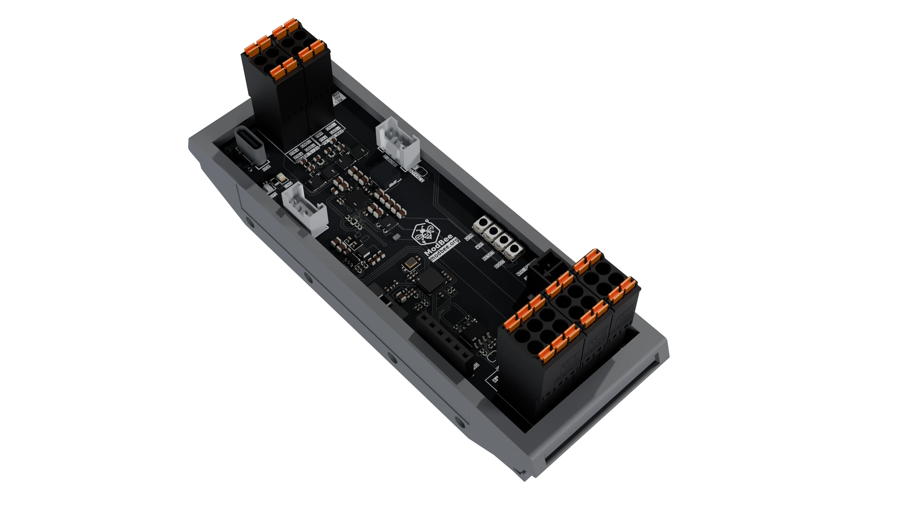

# ModBee MPPT Charger

### Intelligent Solar Charge Controller with MPPT and WiFi Connectivity

A compact, intelligent solar charge controller built on **Texas Instruments' BQ25798** buck-boost battery charger IC, integrated with **ESP32-C3** microcontroller for advanced control, monitoring, and wireless connectivity.



## 🎯 Quick Overview

ModBee MPPT Charger brings together:

• **Texas Instruments BQ25798** - Industry-leading buck-boost MPPT charger IC
• **ESP32-C3** (RISC-V single-core) - WiFi & Bluetooth Low Energy for wireless telemetry
• **Maximum Power Point Tracking (MPPT)** - Autonomous solar power harvesting optimization
• **Multi-Chemistry Support** - 1 to 4-cell Li-Ion, Li-Polymer, or LiFePO4 batteries
• **RS485 Communication** - Modbus integration for networked setups
• **Web-Based Interface** - Real-time monitoring and configuration via WiFi
• **Wide Input Range** - 3.6V to 24V from solar panels, adapters, or variable sources
• **High Efficiency** - Up to 96.5% conversion efficiency at optimal operating points
• **Power Saving** - Light sleep mode and intelligent WiFi/BLE management for extended offline operation


## 🚀 Key Features

### Power Management
✅ **Autonomous MPPT** via sampled open-circuit voltage (VOC) tracking  
✅ **Buck-Boost Topology** - Input voltage adapts seamlessly to output requirements  
✅ **Synchronous Buck Converter** - Stable 3.3V system rail for MCU and peripherals  
✅ **Low Quiescent Current** - 17µA in battery-only mode, 500nA in shutdown  
✅ **Backup Power & UPS** - Operates as standalone charge controller without solar input  
✅ **Redundant Supply Support** - Dual input channels for supply redundancy and failover  

### Power Saving  
✅ **Light Sleep Mode** - SOC-triggered hibernation for extended battery life  
✅ **CPU Frequency Scaling** - 160MHz (active) / 80MHz (low-power) modes  
✅ **WiFi/BLE Control** - Selective enable/disable to minimize idle current  
✅ **Button Wakeup** - GPIO-triggered immediate wake from sleep  
✅ **Auto WiFi Timeout** - Disables WiFi after 5 minutes of inactivity  
✅ **Customizable Setpoints** - Define SOC thresholds for sleep entry  

### Charging & Protection  
✅ **Autonomous Charging Modes** - Or I2C-controlled via ESP32-C3 for custom algorithms  
✅ **Thermal Regulation** - Temperature-based charging limits with shutdown protection  
✅ **OVP/OCP Protection** - Input, battery, and MOSFET overcurrent/overvoltage protection  

### Telemetry & Control
✅ **Integrated 16-bit ADC** - Voltage, current, and temperature monitoring  
✅ **I2C Interface** - Full register access for microcontroller integration  
✅ **WiFi Connectivity** - Real-time data streaming and remote configuration  
✅ **Battery Temperature Sensing** - NTC thermistor monitoring for safe operation  
✅ **Dual-Color Status LED** - Visual feedback for MCU status and charging state  

### Hardware Integration
✅ **RS485 Bus** - Modbus RTU master/slave capability for networked systems  
✅ **Grove I2C Connector** - Easy sensor expansion and external device integration  
✅ **USB-C Interface** - Power input, programming, and data communication  
✅ **External Antenna** - Enhanced WiFi/BLE range for remote deployments  
✅ **Dual Supply Redundancy** - Support for 2x independent power sources with automatic failover  

## 📋 Hardware Specifications

| Feature | Specification |
|---------|---------------|
| **Microcontroller** | ESP32-C3 (RISC-V single-core @ 160 MHz) |
| **Charger IC** | Texas Instruments BQ25798 |
| **Input Voltage Range** | 3.6V to 24V (absolute max 30V) |
| **Charge Current** | 0 to 3A (10mA resolution) |
| **Battery Voltage (Output)** | 3V to 18.8V (supports 1-4S Li-Ion/LiFePO4) |
| **System Output (3.3V)** | Synchronous buck regulator, low dropout |
| **Efficiency** | Up to 96.5% (at optimal operating conditions) |
| **Quiescent Current** | 17µA (battery-only mode); 500nA (shutdown) |
| **Communication** | I2C (BQ25798), RS485, WiFi/BLE, USB-C |
| **Temperature Sensor** | NTC thermistor (10K) for battery monitoring |
| **Status Indicators** | Dual-color LED (Green: MCU status, Blue: charging) |


**⚠️ Safety**: Verify correct polarity before connecting PV, BAT, and LOAD connectors. Reversed polarity can damage components.

## 💻 Quick Start

### 1. Hardware Setup
```
1. Connect solar panel to PV+/PV- (up to 24V)
2. Connect battery to BAT+/BAT- (e.g., 3S Li-Ion 12.6V nominal)
3. Optionally connect loads to LOAD+/LOAD-
4. Connect USB-C for programming and initial configuration
```

### 2. Monitor & Configure
- **Serial Monitor** (115200 baud): Watch boot messages and solar data telemetry
- **Web Interface** (WiFi AP mode): Access `http://192.168.4.1/` (after first boot)

## 📚 Documentation

• [docs/GETTING_STARTED.md](./docs/GETTING_STARTED.md) - Quick setup and first-time configuration  
• [docs/HARDWARE.md](./docs/HARDWARE.md) - Detailed hardware specifications, schematics, and electrical characteristics  
• [docs/SOFTWARE.md](./docs/SOFTWARE.md) - Firmware guide, API reference, and development patterns  
• [docs/API_REFERENCE.md](./docs/API_REFERENCE.md) - Complete code examples and library API reference  

## 🔧 Default Configuration

The device ships with optimized settings for **3S Li-Ion batteries**:

| Parameter | Value | Description |
|-----------|-------|-------------|
| **Vbat** | 12.6V | 3-cell Li-Ion nominal voltage |
| **Icharge** | 2A | Default charge current limit |
| **Vsys** | 12V | System output voltage |
| **ICM (MPPT)** | 3A | MPPT current limit |
| **PVOC** | 18V | MPPT sampled voltage (VOC) |
| **VOC Reset** | 25V | Open-circuit voltage reset threshold |
| **I2C Address** | 0x6B | BQ25798 (hardware address) |

⚠️ **Important**: Adjust `Vbat`, `Icharge`, and `PVOC` via web interface if using different battery chemistries (LiFePO4, 4S, or 1-2S packs).

## 🌟 Use Cases

### Industrial & Commercial
• Wireless device charging in field operations  
• IoT device fleet with WiFi telemetry and Modbus integration  
• Mobile solar-powered equipment  

## 🐛 Troubleshooting

### Solar Not Charging
1. Check polarity on PV+/PV- connectors
2. Verify PV voltage is above 4V (minimum for BQ25798)
3. Check BQ25798 status via I2C: read `REG_CHARGER_STATUS` (0x20)

### Battery Not Detected
1. Verify battery voltage on BAT+ via multimeter
2. Check BQ25798 comparator threshold
3. Confirm battery temperature is within operating range
4. See [docs/SOFTWARE.md](./docs/SOFTWARE.md) for I2C diagnostic code

### WiFi/Serial Not Responding
1. Verify USB-C connection and power to ESP32-C3
2. Check boot mode: hold Boot button while resetting MCU
3. Re-flash latest firmware via PlatformIO
4. Monitor serial output at 115200 baud for error messages

See [docs/HARDWARE.md](./docs/HARDWARE.md) and [docs/SOFTWARE.md](./docs/SOFTWARE.md) for detailed troubleshooting.

## 🤝 Contributing

Contributions are welcome and encouraged! Here are active development areas:

**Upcoming Features**
• **Modbus RTU Telemetry** - Implement Modbus RTU interface for remote monitoring and system integration
• **I2C Slave Telemetry** - Develop I2C slave protocol for integration with master controllers

**Additional Areas**
• Support for additional battery chemistries (Li-Po, LiFePO₄, Pb-acid, NiMH)
• Advanced MPPT algorithms (perturb-and-observe, incremental conductance)
• Web dashboard visualization enhancements
• Mobile app for remote monitoring via Bluetooth
• Performance optimization for MPPT tracking

See [docs/SOFTWARE.md](./docs/SOFTWARE.md#-contributing) for contribution guidelines and more details.

## 📝 License

See [LICENSE](./LICENSE) file for details.

## 📞 Support

For issues, questions, or suggestions:

1. **Hardware Issues?** → Check [docs/HARDWARE.md](./docs/HARDWARE.md) and schematics
2. **Software/Firmware?** → See [docs/SOFTWARE.md](./docs/SOFTWARE.md)
3. **Code Examples?** → Review [docs/API_REFERENCE.md](./docs/API_REFERENCE.md)
4. **Still Stuck?** → Check [examples/](./examples/) folder for working code

## 📦 Project Information

• **Repository**: mod-bee/modbee-mppt-ti-c3  
• **Platform**: ESP32-C3 (RISC-V)  
• **Charger IC**: BQ25798 (Texas Instruments)  
• **Language**: C++/Arduino  
• **Build System**: PlatformIO (Arduino IDE compatible)  
• **License**: See LICENSE file  

---

