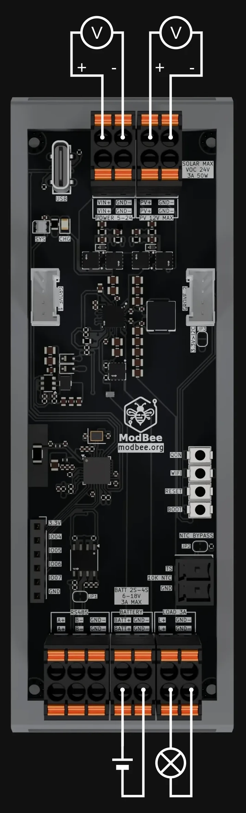

# ModBee MPPT Charger - Hardware Documentation

Complete hardware specifications, schematics, electrical characteristics, and integration guide for the ModBee MPPT Charger.

## � Connection Diagram



**Connection Guide:**
- **PV+/PV-** - Solar panel input (3.6V to 18V)
- **BAT+/BAT-** - Battery output (charge/discharge connections)
- **LOAD+/LOAD-** - System load output ( connect you devices to load and not to the battery )
- **GND** - Common ground
- **USB-C** - Power, programming, serial debug
- **RS485 A/B/GND** - Modbus network connections
- **I2C/Grove** - External sensor expansion
- **Antenna** - External WiFi/BLE antenna connector

**Dual Supply Configuration:**
The device supports redundant power sources:
- Primary: Solar (PV input) or external power adapter
- Secondary: Battery or alternative power source
- Automatic failover to secondary if primary supply drops

## �🔌 Hardware Components Overview

#### ESP32-C3 Microcontroller
- **Part**: ESP32-C3-FH4 (Espressif)
- **Core**: RISC-V single-core @ 160 MHz
- **RAM**: 400 KB SRAM
- **Flash**: 4 MB embedded (via QSPI)
- **I/O**: Up to 22 GPIO pins
- **Communication Protocols**:
  - I2C (primary for BQ25798)
  - SPI (internal flash access)
  - UART (debug serial, RS485 control)
  - WiFi 6 (802.11 b/g/n)
  - Bluetooth Low Energy (BLE 5.0)

#### USB-C Port
- **Connector**: USB Type-C (reversible)
- **Functions**:
  - Power input (5V, up to 500mA)
  - Serial debug interface
  - Programming interface (JTAG/USB-UART bridge)
- **ESD Protection**: Transient suppressors on D+ / D-
- **Power Supply**: Provides 5V to sync buck converter and BQ25798 VCC

#### Synchronous Buck Converter
- **Input Range**: 3.6V to 24V (from USB, battery, or solar)
- **Output**: 3.3V @ up to 500mA (system rail)
- **Topology**: Low-dropout synchronous buck
- **Components**: FET driver, inductor, sense resistors, filtering caps
- **Efficiency**: >90% typical under light load
- **Standby Current**: <50µA when inactive
- **Purpose**: Provides stable 3.3V for ESP32-C3, I2C pull-ups, LED driver

#### External Antenna Chip
- **Connector**: IPEX/U.FL
- **Gain**: +3dBi typical
- **Frequency**: 2.4 GHz (WiFi/BLE)
- **Purpose**: Extends WiFi range in remote/outdoor setups
- **Default**: Onboard ceramic antenna active if external not connected

#### Reset & Boot Buttons
- **BTN_RST**: Hard reset (connected to ESP32-C3 EN pin)
  - Short press: Restart MCU
  - Long press (>5s): Erase WiFi EEPROM and reboot to AP mode
- **BTN_BOOT**: Boot mode selection
  - Hold during reset for firmware upload recovery
- **Pull-ups**: Internal ESP32-C3 pull-ups

#### RS485 Transceiver
- **Connector**: 3-pin (A, B, GND)
- **Baud Rate**: 9600 baud default (configurable)
- **Protocol**: Modbus RTU master/slave capable
- **Half-Duplex**: Single TX/RX pair (direction auto-switching)
- **Termination**: Optional 120Ω resistor (DIP bridge):
  - **Enable** for cable runs >10m
  - **Disable** for short onboard connections
- **Isolation**: Galvanic isolation recommended for multi-device networks
- **Purpose**: Network communication with PLC, SCADA, other ModBee nodes

#### Dual-Color Status LED
- **Color 1 (Green)**: GPIO controlled (MCU status)
  - Solid: System healthy
  - Blink: Normal operation or error
- **Color 2 (Blue)**: BQ25798 charger active signal output
  - Solid: Charging at high current
  - Blink: Charging at low current (absorption/float)
  - Off: Not charging
- **Drive**: Open-drain MOSFET outputs (can drive 20mA total)
- **Resistors**: Current-limiting 330Ω on each LED

#### Battery Temperature Sensor
- **Type**: NTC Thermistor (Negative Temperature Coefficient)
- **Resistance**: 10kΩ @ 25°C typical
- **β-Value**: ~3600K
- **Pull-up**: 10kΩ to 3.3V on main board
- **ADC**: Connected to BQ25798 TSBAT pin
- **Range**: -20°C to +60°C (typical monitoring range)
- **Purpose**: Prevent overheating during fast charges; enables thermal management
- **Thermistor Curve**: See BQ25798 datasheet section 9.3.3.5

#### Texas Instruments BQ25798
- **Function**: Integrated Buck-Boost Converter + Battery Charger + MPPT
- **I2C Address**: 0x6B (7-bit, with R/W bit = 0xD6 write / 0xD7 read)
- **I2C Bus Speed**: 100 kHz (standard), 400 kHz (fast mode) compatible
- **Supply Voltage**: 3.1V to 24V (input dependent)

##### Input/Output Terminals
| Term | Function | Range |
|------|----------|-------|
| VBUS_IN | Primary input (solar/adapter) | 3.6V - 24V |
| BAT | Battery connection | 3V - 18.8V |
| SYS | System/Load output | BAT + margin |

##### Key Features
- **MPPT Algorithm**: Autonomous sampled open-circuit voltage (VOC)
  - Periodically samples PV with load removed
  - Adjusts operating point to ~80% of VOC
  - Can be overridden via I2C for custom algorithms
- **Charging Protocols**: USB PD 3.0, USB BC 1.2, HVDCP, proprietary adapters
- **Buck-Boost Topology**: Single inductor, synchronous buck/boost FETs
- **Power Path Management (NVDC)**: Seamless priority (adapter > battery > load)
- **Efficiency**: Up to 96.5% at certain operating points
- **Integrated ADC**: 16-bit, 1 MHz sampling rate
  - Measures: Input voltage/current, battery voltage/current, temperature
  - I2C readable output registers

#### Default MPPT Parameters
(Programmed via external resistors and I2C registers in firmware):

| Parameter | Register | Firmware Default | Description |
|-----------|----------|------------------|-------------|
| PVOC | 0xA6 | 18V | MPPT sampling voltage (80% of solar Voc) |
| VOC Reset | 0xA7 | 25V | Reset threshold after MPPT timeout |
| ICM (MPPT Imax) | 0xA8 | 3A | Max current for MPPT sampling |
| IIN_DPM | 0x3E | 4A | Input current limit (DPM) |
| VIN_DPM | 0x3D | 6V | Input voltage limit (DPM) |
| Icharge | 0x25 | 2A | Charge current (0-5A, 10mA resolution) |
| Vcharge | 0x26 | 12.6V | Battery charge voltage (3V-18.8V, 5mV resolution) |

#### Protection Features
- **Thermal**: Reduces charge current above 60°C; shuts down >80°C
- **OVP (Overvoltage Protection)**:
  - Input: ~24V hard limit
  - Battery: Programmable per chemistry
  - MOSFET: Integrated gate drivers
- **OCP (Overcurrent Protection)**:
  - Input reverse polarity protection
  - Charge current limit
  - Load output FET OCP
- **Safety Timer**: 10-16 hour charge cycle timer
- **Input DPM**: Voltage/current limit to prevent source collapse
- **Battery FET**: Integrated battery disconnect FET

#### Current Sense
- **Sense Resistor**: Low-ohm on Input and Battery rails
  - Input: ~50mΩ (for DPM + current measurement)
  - Output: ~20mΩ (for charge current feedback)
- **ADC Resolution**: 16-bit allows milliamp-level precision
- **Op-Amp Gain**: Integrated amplifier for millivolt signals

#### Programming Resistors (User-Configurable via I2C Override)
| Component | Default Value | Purpose |
|-----------|---|---------|
| PROG | 18kΩ | Charge current programming (1.25V / R) |
| PVOC Pull-up | 200kΩ | MPPT voltage divider setpoint |
| VOC | 200kΩ | Reset voltage divider |
| Comparator | Various | Fine-tune MPPT behavior |

**Note**: Values in rev 0.01 are representative; firmware updates via I2C provide runtime flexibility.

## 📐 Electrical Specifications

### Power Ratings

| Specification | Value | Notes |
|---------------|-------|-------|
| **Input Voltage (Absolute Max)** | 30V | Exceeding damages BQ25798 |
| **Input Voltage (Recommended)** | 3.6V - 18V | Solar panel typical range |
| **Battery Voltage** | 3V - 18.8V | Supports 1-4 cell packs |
| **Charge Current (Max)** | 3A | 10mA resolution |
| **Load Output (Continuous)** | 3A typical | Limited by internal FET Rds(on) |
| **Load Output (Peak)** | 3A | Brief pulses acceptable |
| **System 3.3V Rail (Max)** | 500mA | Buck converter limit |

### Efficiency Curves

**Note**: Consult BQ25798 datasheet for detailed efficiency graphs

- **MPPT Tracking**: ~85-90% typical (peak ~95%)
- **Buck Mode** (12V → 5V): ~90%+
- **Boost Mode** (5V → 12V): ~92%+
- **Battery Charge**: ~96.5% at nominal inputs

### Thermal Management

| Parameter | Value |
|-----------|-------|
| **Operating Temperature Range** | -10°C to +60°C (recommended); -20°C to +85°C (absolute) |
| **Charge Regulation** | Reduced above 60°C; disabled >80°C |
| **PCB Temperature Rise** | <30°C above ambient at full load (depends on airflow) |
| **Thermal Shutdown** | ~135°C junction temperature |
| **Battery Thermistor Monitoring** | Optional; <50°C recommended for Li-Ion |

**Cooling Recommendation**: Natural convection acceptable for most applications. Forced air for continuous >2A charging in high ambient temps.

## 🔋 Battery Chemistry Defaults & Adjustments

### Preset Configurations

#### 3S Li-Ion (Default)
```
Nominal: 10.8V - 12.6V
Charge Voltage (Vcharge): 12.6V (4.2V/cell)
Charge Current (Icharge): 2A (100% depth, adjust based on battery Ah)
Max Safe Temp: 50°C
PVOC (MPPT): 18V (assumes typical Vmpp for ~24V Voc solar)
```

#### 2S Li-Ion (8.4V)
```
Charge Voltage: 8.4V
Icharge: 1-2A
PVOC: 12V
```

#### 4S Li-Ion (16.8V)
```
Charge Voltage: 16.8V
Icharge: 2-3A
PVOC: 22V
```

#### 3S LiFePO4 (10.8V optimal, 11.55V float)
```
Charge Voltage: 11.55V (3.85V/cell, safer for longevity)
Icharge: 2A
PVOC: 16V
Temperature: <45°C for best lifetime
```

**To adjust**: Edit I2C register 0x26 (Vcharge) and 0x25 (Icharge) via firmware or web interface.

### Typical Operating Currents

| Component | Idle (mA) | Active (mA) | Notes |
|-----------|-----------|-------------|-------|
| **ESP32-C3** | 5 | 80-120 | WiFi active higher |
| **BQ25798** | 0.01 | 150-500 | Charger operation & MPPT |
| **Synchronous Buck** | 0.05 | 30-50 | Efficiency >90% |
| **RS485 Transceiver** | 0.5 | 5-10 | Half-duplex |
| **LED Drivers** | 0 | 20-40 | Both colors at full brightness |
| **System Total** | ~5-10 mA | 200-500+ mA | Depends on WiFi, LED state |

### Power Path
```
Solar/Adapter (24V max)
  ↓
[BQ25798 Input Mux]
  ├→ Charge Battery
  └→ Supply System Load (SYS rail)

System 3.3V (from sync buck)
  ├→ ESP32-C3 (primary consumer)
  ├→ I2C pull-ups
  ├→ RS485 supply
  └→ LED control circuits
```

## 🌡️ Derating & Thermal Model

### Recommended Operating Envelope
- **Solar Input**: 5V - 18V with max 24VOC (optimal 15-18.8V for Li-Ion charging)
- **Battery**: 8V - 18.8V (for 4S Li-Ion nominal)
- **Ambient Temperature**: -10°C to +40°C (recommended); max +50°C
- **Charge Current**: 0.5A - 3A (max 5A, but thermal limits apply)

## 🛡️ Protection Features (Detailed)

### Input Over-Voltage Protection (OVP)
- **Threshold**: ~24V nominal (BQ25798 comparator)
- **Action**: Disable charging, alert via register bit
- **Recovery**: Auto when voltage drops below threshold

### Input Under-Voltage Protection
- **Threshold**: ~3.1V minimum for BQ25798 operation
- **Action**: Halt charging, disable outputs if set

### Thermal Shutdown
- **Threshold**: >135°C (junction temperature)
- **Action**: All charging disabled; cooling required before restart
- **Monitor**: Via BQ25798 STATUS register (bit 0)

### Charging Safety Timer
- **Duration**: 10-16 hours typical
- **Purpose**: Prevent stuck charger charging indefinitely
- **Reset**: On each new charge cycle (system restart or I2C write)

### Current Limiting
- **Input DPM**: Limits input current to prevent source brown-out
- **Charge Current**: Programmable 0-5A
- **Load OCP**: MOSFET integrated current sense with ~100mΩ Rds(on) limit

## 📦 Bill of Materials (BOM) Summary

## 🔗 Related Resources

- [BQ25798 Datasheet](https://www.ti.com/product/BQ25798)
- [ESP32-C3 Technical Reference](https://espressif-docs.readthedocs.io/projects/esp-idf/en/v5.0/)
- [RS485 Best Practices](https://en.wikipedia.org/wiki/RS-485)
- [ModBee MPPT Charger Schematics](../schematics/)

---

For firmware-level I2C register details, see [docs/SOFTWARE.md](./SOFTWARE.md).
